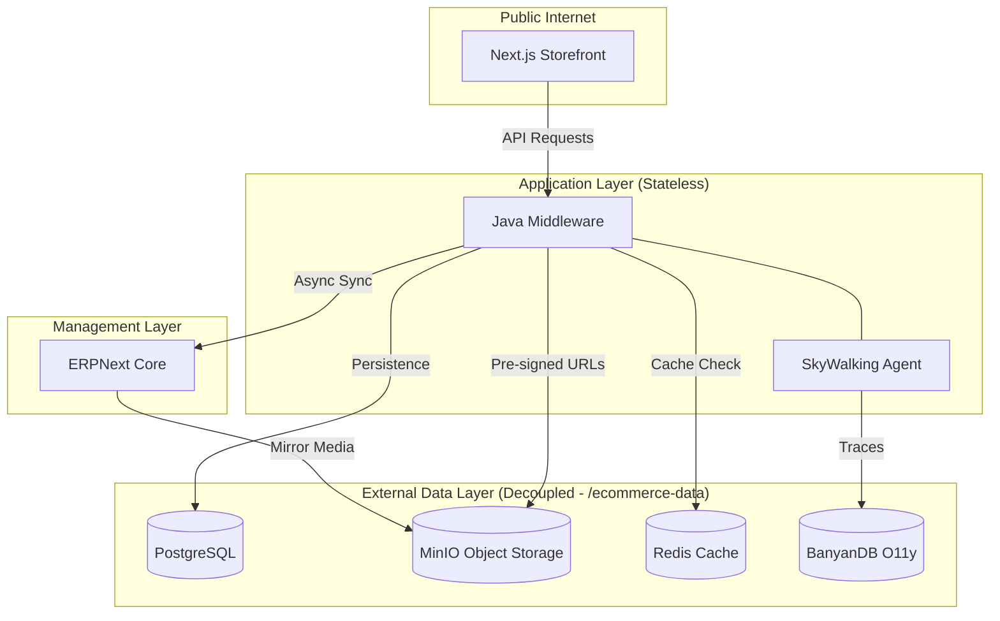
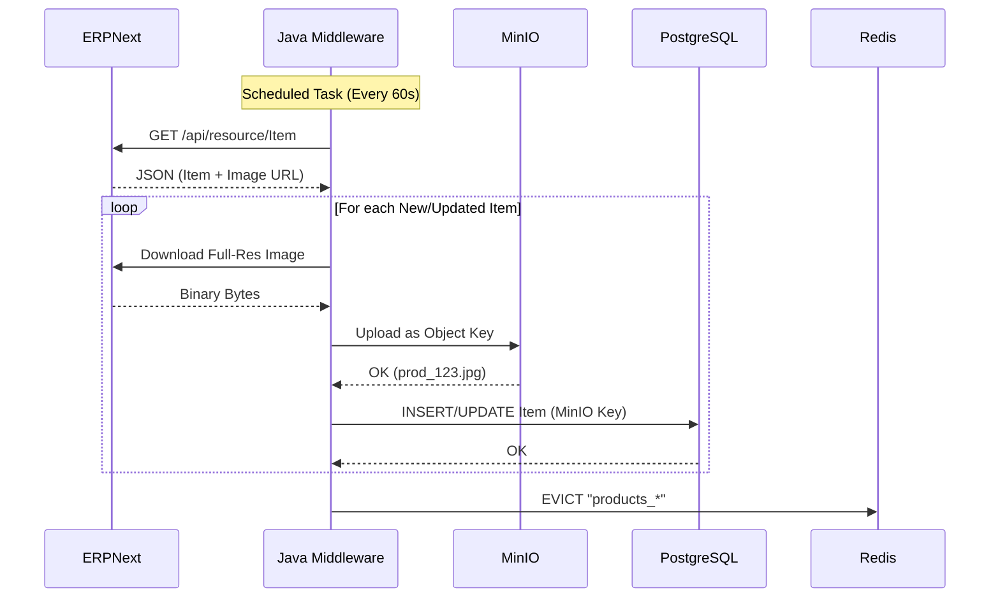
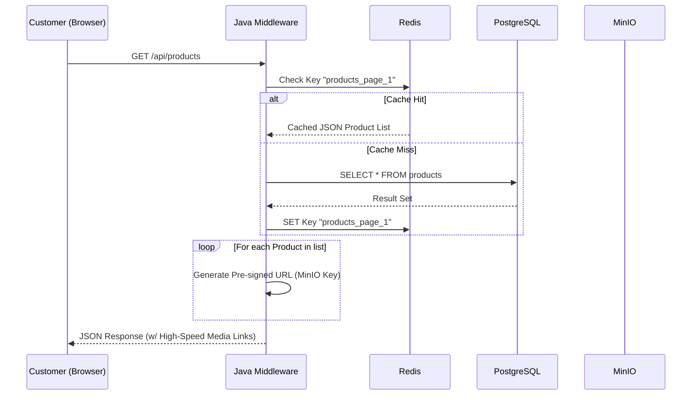

# E-Commerce Platform Architecture & Flow Diagrams

This document outlines the decoupled, high-performance architecture designed for 100+ RPS.

---

## 🏗️ 1. System Component Architecture

---

## 🔄 2. Product Synchronization Flow (ERPNext -> MinIO)

---

## ⚡ 3. High-Load Serving Flow (Cached)

