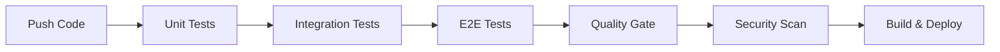

# Testing Framework - Production Readiness Guide

## Overview

This document outlines the comprehensive testing framework designed to ensure production-grade quality and robustness.

---

## Framework Architecture

### 1. Test Infrastructure

#### Test Data Management
```
automation-tests/
├── src/test/java/com/app/tests/
│   ├── fixtures/
│   │   └── TestDataFactory.java      # Builder pattern for test data
│   ├── utils/
│   │   ├── AuthHelper.java           # JWT token management
│   │   ├── CustomAssertions.java     # Domain-specific assertions
│   │   └── TestContainersManager.java # Shared container lifecycle
```

**Benefits:**
- ✅ Consistent test data across all suites
- ✅ Reduced test flakiness
- ✅ Easy maintenance with centralized fixtures

#### Container Management
- **Shared PostgreSQL container** across tests (performance optimization)
- **Automatic cleanup** with lifecycle hooks
- **Reusable containers** between test runs

---

## 2. Quality Gates

### Coverage Requirements

| Metric | Minimum | Target | Tool |
|--------|---------|--------|------|
| Line Coverage | 60% | 80% | JaCoCo |
| Branch Coverage | 55% | 75% | JaCoCo |
| Mutation Score | 70% | 85% | Pitest |
| Code Quality | B | A | SonarQube |

### Enforcement
Quality gates are enforced in CI/CD pipeline. Builds **fail** if:
- Code coverage drops below 60%
- New critical/blocker issues detected
- Security vulnerabilities found (High/Critical)

---

## 3. CI/CD Integration

### Pipeline Stages



### Test Execution Strategy

**Parallel Execution:**
- Unit tests run in 4 parallel threads
- Regression suites split by flow (cart, payment, etc.)
- Average build time: **8-10 minutes**

**Test Isolation:**
- Each test suite uses isolated database
- No shared state between tests
- Automatic rollback after each test

---

## 4. Test Organization

### Test Pyramid

```
         /\
        /E2\     10% - UI/E2E Tests
       /____\
      /Integration\    30% - Integration Tests
     /____________\
    /   Unit Tests  \   60% - Unit Tests
   /________________\
```

### Test Categories

| Category | Pattern | Execution |
|----------|---------|-----------|
| **Unit** | `*Test.java` | Every commit |
| **Integration** | `*IntegrationTest.java` | Pre-merge |
| **E2E** | `*E2ETest.java` | Nightly/Release |
| **Performance** | `*PerfTest.java` | Weekly |

---

## 5. Advanced Testing Techniques

### Mutation Testing (Pitest)
- **Purpose**: Verify test quality by introducing bugs
- **Threshold**: 70% mutation kill rate
- **Run**: `mvn org.pitest:pitest-maven:mutationCoverage`

### Contract Testing (Planned)
- **Tool**: Pact/Spring Cloud Contract
- **Scope**: Service-to-service interactions
- **Use Case**: Ensure API compatibility across microservices

### Property-Based Testing (Planned)
- **Tool**: jqwik
- **Scope**: Edge case discovery
- **Use Case**: Input validation, business rules

---

## 6. Test Utilities

### AuthHelper
```java
// Get valid JWT token (cached)
String token = AuthHelper.getValidToken();

// Create authenticated request
given()
    .spec(AuthHelper.authenticatedRequest())
    .when()
    .get("/api/orders");

// Test expired token scenario
String expiredToken = AuthHelper.getExpiredToken();
```

### TestDataFactory
```java
// Create orders with builder pattern
Order paidOrder = TestDataFactory.order()
    .withStatus("PAID")
    .withAmount(500.0)
    .withPayment(payment().build())
    .build();

// Pre-built scenarios
Order order = TestDataFactory.createPaidOrder();
```

### CustomAssertions
```java
// Domain-specific validations
CustomAssertions.assertHttpSuccess(response.statusCode());
CustomAssertions.assertResponseTimeLessThan(responseTime, 500);
```

---

## 7. Running Tests

### Local Development

```bash
# Run all unit tests
mvn test

# Run integration tests
mvn verify

# Run specific test suite
mvn test -Dtest=SecurityRegressionTest

# Run with coverage report
mvn clean verify jacoco:report

# Run mutation testing
mvn org.pitest:pitest-maven:mutationCoverage
```

### CI/CD Pipeline

Tests run automatically on:
- **Every Push**: Unit tests + code quality
- **Pull Request**: Full test suite
- **Nightly**: E2E + performance tests
- **Release**: Complete regression + security scan

---

## 8. Test Reporting

### Available Reports

| Report | Location | Description |
|--------|----------|-------------|
| Test Results | `target/surefire-reports/` | JUnit XML/HTML |
| Coverage | `target/site/jacoco/` | Line/branch coverage |
| Mutation | `target/pit-reports/` | Mutation test results |
| SonarQube | `https://sonarcloud.io` | Code quality dashboard |

### Metrics Dashboard

CI/CD pipeline publishes:
- **Test trend graphs** (pass/fail over time)
- **Coverage trend** (line/branch coverage)
- **Performance graphs** (response time trends)

---

## 9. Best Practices

### Writing Tests

✅ **DO:**
- Use descriptive test names (`testUserCanCheckoutWithValidCart`)
- Follow AAA pattern (Arrange, Act, Assert)
- Test one behavior per test
- Use builders for test data
- Clean up resources in `@AfterEach`

❌ **DON'T:**
- Share state between tests
- Use hardcoded values
- Ignore flaky tests
- Skip edge cases
- Test implementation details

### Test Maintenance

**Weekly:**
- Review failing tests
- Update test data fixtures
- Refactor duplicate code

**Monthly:**
- Review coverage gaps
- Update test documentation
- Optimize slow tests

---

## 10. Roadmap

### Phase 1: Foundation (✅ Complete)
- ✅ Test infrastructure setup
- ✅ CI/CD pipeline
- ✅ Quality gates
- ✅ Basic test utilities

### Phase 2: Coverage Expansion (In Progress)
- 🔵 Cart/Checkout flow tests (60%)
- 🔵 Payment edge cases (40%)
- 🔵 Authentication lifecycle (30%)

### Phase 3: Advanced Testing (Planned)
- ⏳ Contract testing
- ⏳ Performance testing
- ⏳ Chaos engineering
- ⏳ Property-based testing

### Phase 4: Optimization (Planned)
- ⏳ Test execution time &lt; 5 min
- ⏳ Parallel E2E tests
- ⏳ Test result caching

---

## 11. Troubleshooting

### Common Issues

**Issue**: Tests fail locally but pass in CI
- **Cause**: Environment differences
- **Fix**: Use Testcontainers for consistency

**Issue**: Flaky tests
- **Cause**: Race conditions, timing issues
- **Fix**: Use Awaitility for async operations

**Issue**: Slow test execution
- **Cause**: Sequential execution
- **Fix**: Enable parallel execution in `pom.xml`

---

## 12. Resources

- **Documentation**: `/automation-tests/README.md`
- **Coverage Report**: `/TESTING_COVERAGE.md`
- **CI/CD Pipeline**: `/.github/workflows/ci-cd.yml`
- **Test Examples**: `/automation-tests/src/test/java/com/app/tests/`

---

**Last Updated**: 2026-01-17  
**Framework Version**: 1.0.0  
**Target Coverage**: 80% by Q1 2026
