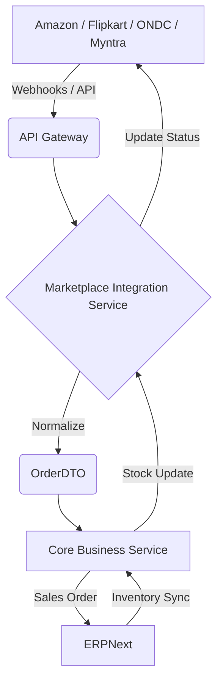

# High-Level Architecture: Multi-Marketplace Integration

This document outlines the system architecture for integrating various e-commerce marketplaces with our core fulfillment system (ERPNext).

## 1. System Overview
The architecture is designed to be **highly modular**, **scalable**, and **resource-efficient** (fitting within a 4.5GB RAM budget).

## 2. Component breakdown

### A. API Gateway (Spring Cloud Gateway)
- **Role**: Single entry point for all external webhooks and internal service traffic.
- **Features**: Rate limiting, routing, and basic authentication for webhook endpoints.

### B. Marketplace Integration Service (MIS) - [Consolidated]
- **Role**: The "Adapter Layer" for all external marketplace protocols.
- **Key Modules**:
    - **Amazon Adapter**: Connects to SP-API.
    - **Flipkart Adapter**: Connects to Flipkart Seller API.
    - **ONDC Adapter**: Handles Beckn protocol.
    - **Webhook Manager**: Receives and validates real-time notifications.
- **Responsibility**: Fetching raw data and transforming it into our internal `OrderDTO`.

### C. Core Business Service (CBS)
- **Role**: The "Orchestrator" of business logic.
- **Key Modules**:
    - **Order Processor**: Validates normalized orders against business rules.
    - **Inventory Manager**: Syncs stock levels between ERPNext and the Integration Service.
    - **Store Manager**: Handles multi-store credentials and configurations.
- **Responsibility**: Interfacing with **ERPNext** for fulfillment and acting as the source of truth for business states.

## 3. Deployment Topology
- **Consolidated Services**: To save memory, multiple adapters are hosted within the single MIS service.
- **Stateless Design**: All services are stateless, scaling horizontally as needed.
- **Shared Infrastructure**: PostgreSQL for persistence, Redis for caching/throttling.
