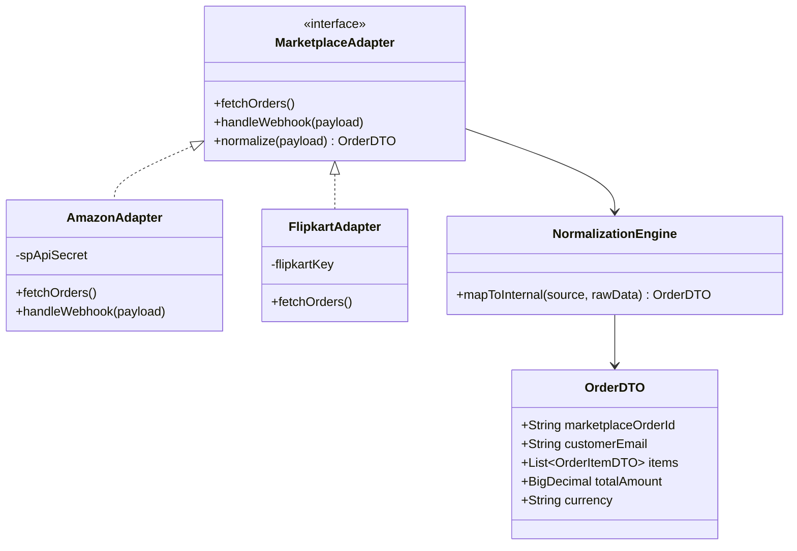

# Low-Level Design: Multi-Marketplace Integration

This document details the internal components and data structures for the Marketplace Integration Service (MIS) and Core Business Service (CBS).

## 1. Class Diagram (Conceptual)

## 2. Webhook & Event Flow

### Sequence: Webhook Processing
1. **Endpoint**: `POST /webhooks/{channel}`
2. **Security**: Verifies `X-Marketplace-Signature`.
3. **Idempotency**: Checks Redis for `webhook:{channel}:{event_id}`.
4. **Persistence**: Saves raw payload to `raw_events` table.
5. **Processing**: Triggers `MarketplaceAdapter.handleWebhook()`.
6. **Dispatch**: Publishes `OrderIngestedEvent` for the Core Business Service.

## 3. Rate Limiting Strategy
- **Bucket-4j + Redis**: Ensures horizontal scalability.
- **Quota Management**:
    - Amazon: 10 req/s.
    - Flipkart: 5 req/s.
- **Circuit Breaker**: Resilience4j implemented on outbound marketplace API calls.

## 4. Error Handling & DLQ
- **Retry Policy**: 3 retries with exponential backoff for transient network errors.
- **DLQ**: Permanently failing payloads (e.g., schema validation errors) are moved to the `dead_letter_events` table for manual intervention.
